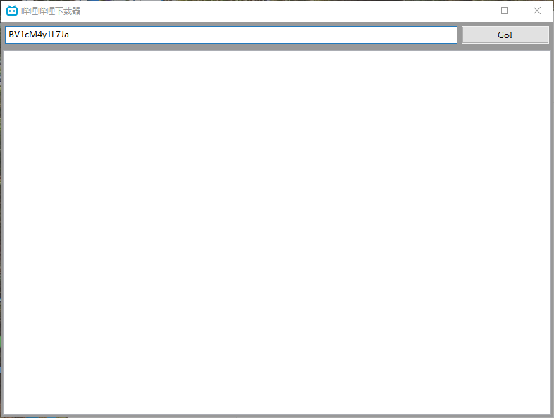
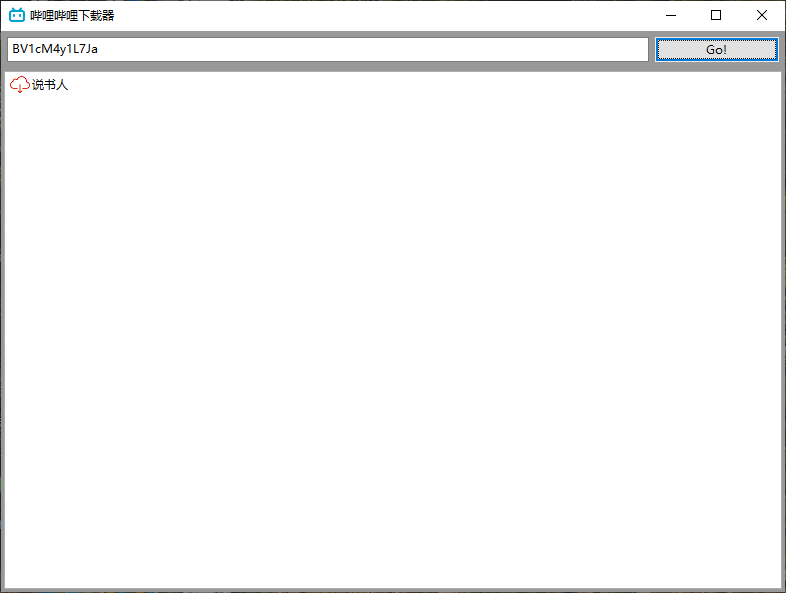
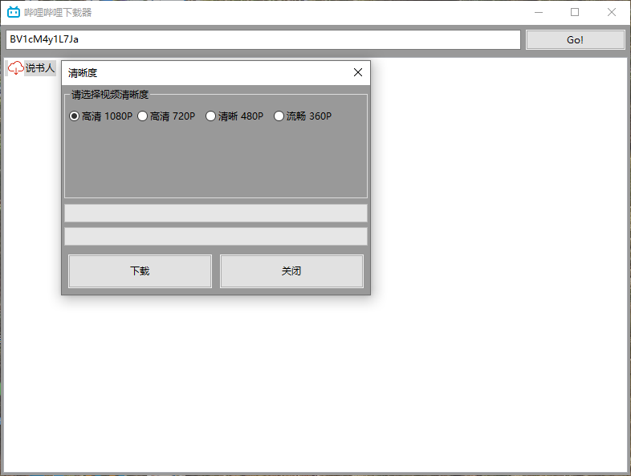
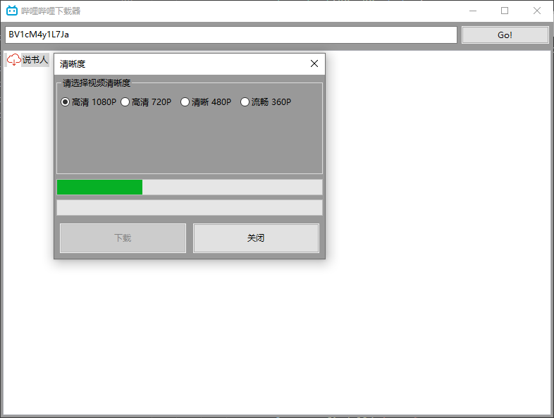
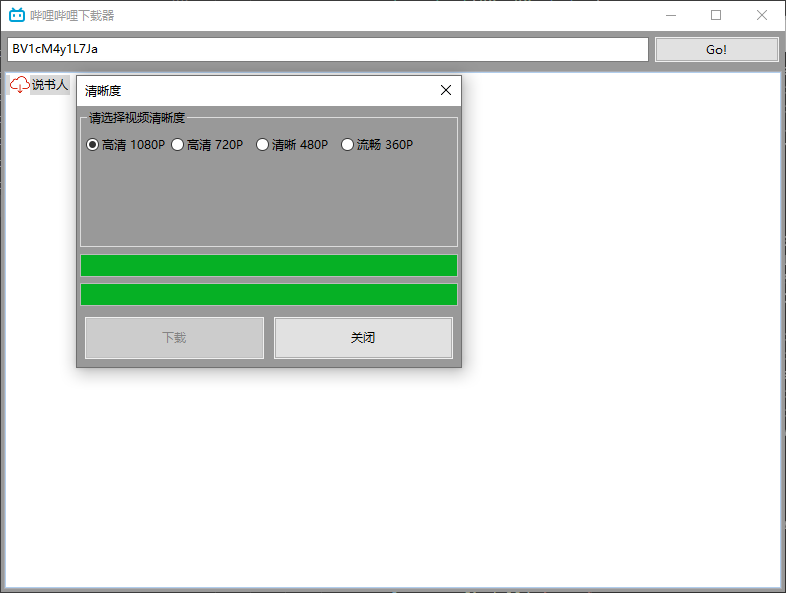
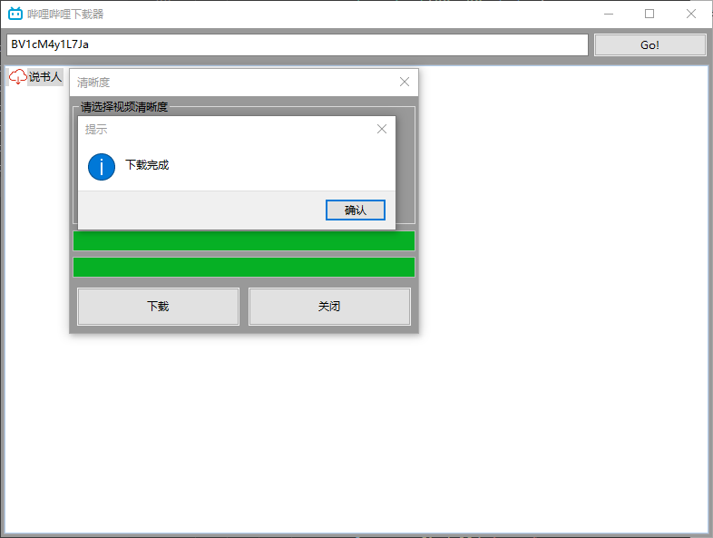

# 哔哩哔哩下载器

🤡：哔哩哔哩视频下载

## 使用

1、安装依赖

```bash
pip install -r requirements.txt
```

`注意：需要用到FFmpeg来合并音频和视频`

👉[FFmpeg](https://ffmpeg.org/)👈

2、运行

```bash
python main.py
```

## 效果展示

1、输入视频的BV号，获取视频下载地址



2、点击要下载的视频分P



2、选择视频清晰度（默认高清 1080P）



点击下载按钮开始下载







