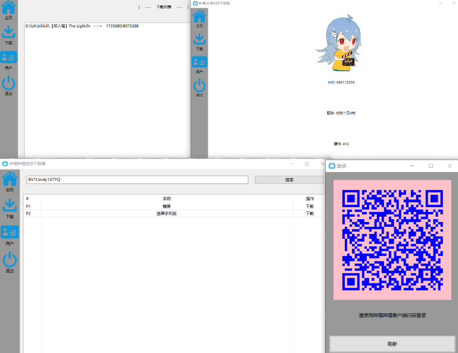

# 哔哩哔哩 (゜-゜)つロ 干杯~

[](https://www.bilibili.com/)   使用`wxPython`开发的B站视频下载工具，实现了扫码登录、视频下载等功能，但仍存在许多不足与bug。如果发现错误，还请在`Issues`中指出，欢迎`Fork`和`Pull requests`改善代码，谢谢！

[](https://www.wxpython.org/)

[Installation](#Installation) | [Usage](#Usage) | [Example](#Example) | [Thank](#Thank)

- [ ] 密码登录
- [ ] 短信登录
- [ ] SNS登录（QQ&微博）
- [x] 二维码登录
- [x] 视频下载
- [ ] 视频清晰度选择
- [ ] 下载进度条

ʕ•̫͡•ʔ-̫͡-ʕ•͓͡•ʕ•̫͡•ʔ-̫͡-ʕ•͓͡•ʔ-̫͡-ʔ

## Installation

1、克隆仓库

```bash
git clone https://github.com/lyh2048/bilibili_downloader_gui.git
```

2、进入目录

```bash
cd bilibili_downloader_gui
```

3、安装依赖

```bash
pip install -r ./requirements.txt
```

Then enjoy it ~

## Usage

```bash
python ./main.py
```

## Example



## Thank

[bilibili-API-collect](https://github.com/SocialSisterYi/bilibili-API-collect)

[Welcome to wxPython!](https://www.wxpython.org/)

